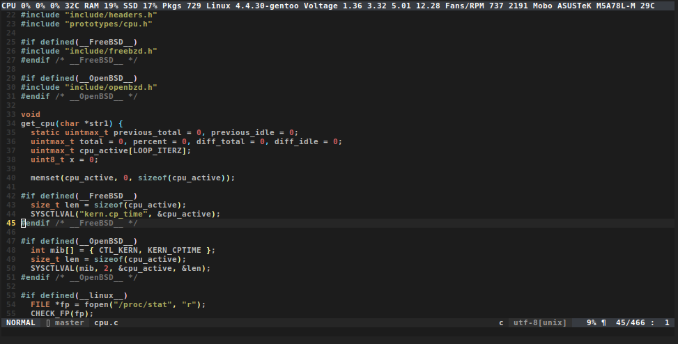

Notice the first grey CPU 0% 0% 0% line



yepstat is acting like status line that overwrites your very first terminal line every 0.5 seconds, so you can easily keep track of things that you are interested to monitor while hacking something in the terminal. It's meant to be efficient and fast even when under 100% cpu and drive I/O load.

This is exactly what we do: save the current position of the cursor, move it to the top left corner of the terminal, clear the entire line, output the desired data and restore the cursor position, so you get the feeling that there is a real status line up there.

Here is the `tput` equivalent of yepstat:

```bash
while true; do tput sc;tput cup 0 0; tput el;printf '%s' 'Hello World';tput rc;sleep 0.5;done &
```

We could also use the -S option:

```bash
while true; do tput -S <<EOF
sc
cup 0 0
el
EOF
;printf '%s' 'Hello World';tput rc;sleep 0.5;done &
```

To be able to use PageUp and PageDown in your terminal, you'll have to disable auto scrolling on tty output.

Do some simple benchmark to grasp over why tput doesn't provide us enough speed. Use the first tput example and decrease the sleep time to 0.1. Then try typing some text over and over as fast as you can and notice how many characters will NOT be written. Open up this program source code and replace "500L *" with "100L *", recompile and repeat the typing test. Move to the second tput example and again decrease the sleep down 0.1, and repeat the typing test.

Once you understand the concept, you'll find [6] interesting, after which you'll get why the program needs to be as fast as possible.

Spoiler, single iteration comparison:

```bash
# yepstat
real    0m0.001s
user    0m0.000s
sys     0m0.000s

# tput
real    0m0.006s
user    0m0.002s
sys     0m0.002s

# the shell alone
# echo -en "\0337\033[1;1H\033[K" open and read /tmp/yepstat "\0338"
real    0m0.003s
user    0m0.001s
sys     0m0.002s
```

Obviously the "speed" has it's price and it's the compatibility that tput provides.

---

# Installation

```bash
make
sudo make install
```

---

# Usage

Changing colours, font type, boldness and so on happens by using ANSI escape codes [1] , [2] , [3] and [4]

We use tmpfs (your RAM), so even when your drive is under heavy write and read I/O the program to remain lightning fast.

```bash
# The updating process
while true; do echo '\e[101;96mlight cyan fg on light red bg\e[0m'; done | ./yepstat &

# instead using "print,printf,echo",
# but you'll have to replace "033,x1B" occurences with "\e"
while true; do print2 '\e[101;96mlight cyan fg on light red bg\e[0m'; done | ./yepstat &
```

---

# Requirements

* gcc/clang
* glibc/libc
* terminal emulator supporting ANSI escape codes [5]

[1]: https://en.wikipedia.org/wiki/ANSI_escape_code
[2]: http://www.growingwiththeweb.com/2015/05/colours-in-gnome-terminal.html
[3]: http://www.tldp.org/HOWTO/Bash-Prompt-HOWTO/c327.html
[4]: https://stackoverflow.com/questions/5947742/how-to-change-the-output-color-of-echo-in-linux/23006365
[5]: https://en.wikipedia.org/wiki/List_of_terminal_emulators
[6]: https://unix.stackexchange.com/questions/116629/how-do-keyboard-input-and-text-output-work
